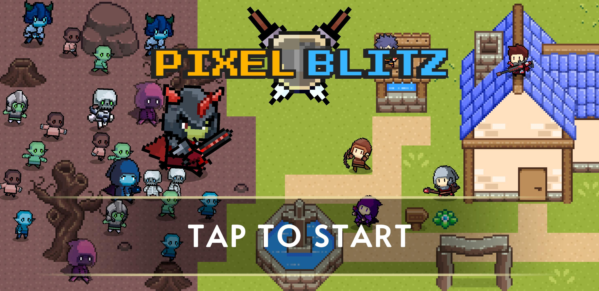

  

  <b>A 2D Strategy Tower Defense Game built with Unity & C#</b>

  
  

---

## Overall

**Pixel Blitz** is a fast-paced 2D Tower Defense game inspired by Tower Defense Simulator (Roblox), where players place and manage strategic characters, and defend multiple waves of enemies and bosses.

### Gameplay
* You drag a character from your loadout to place it. Then tap it to see the stats and upgrade it.
* Each wave, enemies will spawn. After each wave, enemies will become stronger.
* Kill enemies to protect the main base.
* Survive until the last wave to face the final boss. Defeat it to gain rewards.
* Weapons are guaranteed to drop upon victory. Equip them to your characters to permanently enhance them.
* Spend earned gems and diamonds to unlock new characters and open loot chests for random weapons.
### Highlights
* **Diverse Tower**: Deploy unique towers with powerful upgrades and abilities.
* **Enemy Varieties**: Defend against monsters with special traits and stun abilities, and kill the final boss with special skills.
* **Challenging Maps**: Survive multiple waves across varied terrains and path layouts.
* **Shop & Progression**: Earn in-game rewards to unlock new characters, weapons, and discover more difficult maps.
---

## Installation

### How to Install (Android)

1. **Get the APK**: Head over to the [Releases](../../releases) tab of this repository and download the latest `.apk` build.
2. **Install & Launch**: Follow the on-screen prompts to complete setup, then launch **Pixel Blitz** from your home screen or app drawer.
---

### Important Notes
* **Platform Compatibility**: Only optimized for Android devices.
* **Storage**: Ensure your device has at least **200–300 MB** of free internal storage for a smooth installation and cache allocation.
* **Security Notice**: Android may flag sideloaded APKs with a standard warning (*"File might be harmful"*). You can safely proceed by tapping **Download anyway** / **Install anyway**.
---

### How to Update

* To update to the latest patch, download the new `.apk` from the latest release and run the installer directly.
* The installer will update the existing package without needing to uninstall the previous version.
